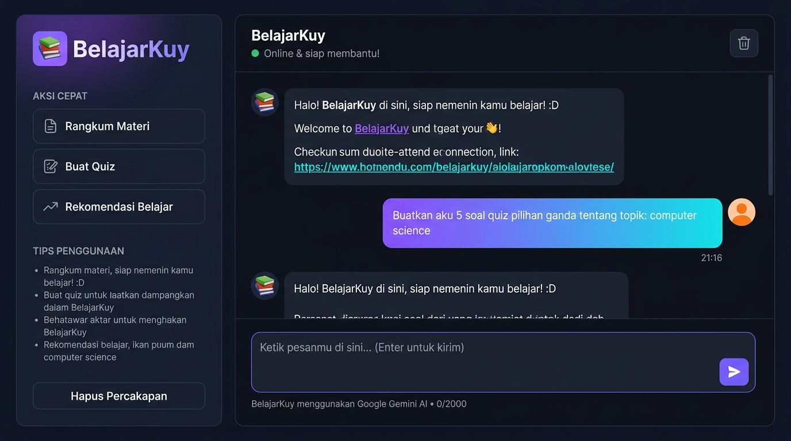

# BelajarKuy — AI Study Companion Chatbot

**BelajarKuy** adalah aplikasi chatbot berbasis web yang mengintegrasikan Google Gemini AI sebagai engine bahasa alami. Aplikasi ini dirancang sebagai teman belajar virtual yang membantu pengguna merangkum materi, membuat quiz interaktif, dan mendapatkan rekomendasi sumber belajar.

---

## Daftar Isi

1. [Gambaran Umum](#1-gambaran-umum)
2. [Tampilan Aplikasi](#2-tampilan-aplikasi)
3. [Persyaratan Sistem](#3-persyaratan-sistem)
4. [Struktur Proyek](#4-struktur-proyek)
5. [Instalasi](#5-instalasi)
6. [Konfigurasi](#6-konfigurasi)
7. [Menjalankan Aplikasi](#7-menjalankan-aplikasi)
8. [Penggunaan](#8-penggunaan)
9. [Arsitektur Teknis](#9-arsitektur-teknis)
10. [API Reference](#10-api-reference)
11. [Konfigurasi Model AI](#11-konfigurasi-model-ai)
12. [Penjelasan Kode](#12-penjelasan-kode)
13. [Troubleshooting](#13-troubleshooting)

---

## 1. Gambaran Umum

### Use Case

BelajarKuy ditargetkan untuk pelajar dan mahasiswa yang membutuhkan bantuan belajar secara interaktif. Chatbot ini beroperasi dengan tiga kemampuan utama:

| Fitur | Deskripsi |
|-------|-----------|
| **Rangkuman Materi** | Menghasilkan ringkasan terstruktur dari topik yang diberikan pengguna |
| **Quiz Interaktif** | Membuat 5 soal pilihan ganda (A/B/C/D) dari topik tertentu |
| **Rekomendasi Belajar** | Menyarankan minimal 3 sumber belajar terpercaya |

### Teknologi

| Komponen | Teknologi |
|----------|-----------|
| Frontend | HTML5, CSS3, Vanilla JavaScript |
| Backend | Node.js v24+, Express.js v5 |
| AI Engine | Google Gemini 3.6 Flash (via `@google/genai` SDK) |
| Konfigurasi | dotenv |
| Protokol | REST API, JSON over HTTP |

### Persona AI

Chatbot dikonfigurasi dengan system instruction yang menetapkan persona bernama "BelajarKuy" — berbicara dalam Bahasa Indonesia dengan gaya santai, memberikan analogi sederhana, dan memformat respons menggunakan Markdown.

---

## 2. Tampilan Aplikasi



**Keterangan tampilan:**

- **Sidebar kiri**: Panel navigasi yang berisi tombol aksi cepat (Rangkum Materi, Buat Quiz, Rekomendasi Belajar) dan tips penggunaan.
- **Header**: Menampilkan nama chatbot, status koneksi aktif, dan tombol hapus percakapan.
- **Area chat**: Menampilkan riwayat percakapan dengan bubble terpisah untuk pesan pengguna (kanan, gradien ungu-cyan) dan respons AI (kiri, kartu gelap).
- **Input area**: Textarea yang dapat disesuaikan ukurannya secara otomatis, dilengkapi counter karakter dan tombol kirim.

---

## 3. Persyaratan Sistem

### Software

| Software | Versi Minimum | Keterangan |
|----------|--------------|------------|
| Node.js | v18.0.0 | Disarankan v20 LTS atau v24+ |
| npm | v9.0.0 | Disertakan bersama Node.js |
| Browser | Chrome 90+, Firefox 88+, Edge 90+ | Untuk mengakses antarmuka web |

### Akun dan API Key

- Akun Google (Gmail)
- API Key Google Gemini — diperoleh dari [Google AI Studio](https://aistudio.google.com/app/apikey)

### Verifikasi Instalasi Node.js

Jalankan perintah berikut di terminal untuk memverifikasi:

```bash
node --version
npm --version
```

Output yang diharapkan:

```
v24.19.0
10.x.x
```

---

## 4. Struktur Proyek

```
chatbot-daily/
│
├── server.js                  # Entry point — Express server, API endpoint, Gemini SDK
├── package.json               # Metadata proyek dan daftar dependensi
├── package-lock.json          # Lockfile versi dependensi (auto-generated)
├── .env                       # Variabel lingkungan (GEMINI_API_KEY, PORT)
├── .gitignore                 # File/folder yang dikecualikan dari Git
│
├── public/                    # Static files yang disajikan langsung oleh Express
│   ├── index.html             # Halaman utama — struktur HTML antarmuka chat
│   ├── style.css              # Stylesheet — dark theme, layout, animasi
│   └── script.js             # JavaScript frontend — fetch, render, interaksi UI
│
├── docs/                      # Dokumentasi proyek
│   └── assets/
│       └── preview.jpg        # Screenshot tampilan aplikasi
│
├── PRD.md                     # Product Requirements Document
├── SKILLS.md                  # Daftar keahlian yang dibutuhkan
├── AGENTS.md                  # Definisi agent dalam sistem
├── WORKFLOW.md                # Alur kerja pengembangan dan runtime
├── TODO.md                    # Task list dan checklist pengembangan
├── ARCHITECTURE.md            # Arsitektur teknis sistem
└── README.md                  # Dokumentasi utama (file ini)
```

---

## 5. Instalasi

### Langkah 1 — Clone atau Unduh Proyek

Jika proyek sudah berada di direktori lokal, lewati langkah ini. Jika menggunakan Git:

```bash
git clone <url-repositori>
cd chatbot-daily
```

### Langkah 2 — Inisialisasi Proyek Node.js

Jika membangun dari awal (file `package.json` belum ada):

```bash
npm init -y
```

Jika sudah memiliki `package.json`, lewati langkah ini.

### Langkah 3 — Instalasi Dependensi

Jalankan perintah berikut dari direktori root proyek:

```bash
npm install
```

Perintah ini akan membaca `package.json` dan menginstal semua dependensi yang tercantum:

```
added 109 packages, and audited 110 packages in 5s
```

Jika instalasi dari awal, jalankan:

```bash
npm install express @google/genai dotenv
```

**Penjelasan setiap dependensi:**

| Paket | Versi | Fungsi |
|-------|-------|--------|
| `express` | ^5.2.1 | Framework web untuk membuat REST API dan menyajikan file statis |
| `@google/genai` | ^2.21.0 | SDK resmi Google Generative AI untuk Node.js (mendukung format API key terbaru) |
| `dotenv` | ^17.4.2 | Memuat variabel dari file `.env` ke `process.env` |

> **Catatan:** Proyek ini menggunakan `@google/genai` (SDK generasi baru), bukan `@google/generative-ai` (SDK lama). Pastikan menggunakan paket yang benar karena keduanya berbeda dalam cara inisialisasi dan pemanggilan API.

### Langkah 4 — Verifikasi Instalasi

```bash
ls node_modules | grep "@google"
```

Output yang diharapkan:

```
@google
```

---

## 6. Konfigurasi

### 6.1 Mendapatkan API Key Gemini

1. Buka [https://aistudio.google.com/app/apikey](https://aistudio.google.com/app/apikey)
2. Login dengan akun Google
3. Klik tombol **"Create API key"**
4. Pilih project Google Cloud yang ada, atau buat project baru
5. Salin API key yang ditampilkan

> **Penting:** API key yang dikeluarkan oleh Google AI Studio saat ini menggunakan format baru yang dimulai dengan `AQ.` (bukan `AIza` seperti format lama). Format `AQ.` **hanya kompatibel** dengan SDK `@google/genai`, bukan `@google/generative-ai`.

### 6.2 Membuat File `.env`

Buat file `.env` di direktori root proyek:

```bash
touch .env
```

Isi file `.env` dengan konfigurasi berikut:

```env
GEMINI_API_KEY=AQ.xxxxxxxxxxxxxxxxxxxxxxxxxxxxxxxxxxxxxx
PORT=3000
```

**Penjelasan variabel:**

| Variabel | Wajib | Default | Deskripsi |
|----------|-------|---------|-----------|
| `GEMINI_API_KEY` | Ya | — | API key dari Google AI Studio |
| `PORT` | Tidak | `3000` | Port server Express berjalan |

### 6.3 Memastikan `.env` Tidak Ter-commit ke Git

Verifikasi bahwa `.gitignore` sudah berisi entri berikut:

```
node_modules/
.env
```

Jangan pernah meng-commit file `.env` ke repositori publik karena mengandung credential sensitif.

---

## 7. Menjalankan Aplikasi

### Mode Produksi

```bash
npm start
```

atau secara langsung:

```bash
node server.js
```

### Mode Development (Auto-restart saat file berubah)

```bash
npm run dev
```

Perintah ini menggunakan `node --watch` yang tersedia di Node.js v18.11+ untuk merestart server secara otomatis ketika ada perubahan pada file.

### Output Server yang Diharapkan

```
🚀 BelajarKuy server berjalan di http://localhost:3000
🤖 Model: gemini-3.6-flash
📚 Siap membantu belajar!
```

### Mengakses Aplikasi

Buka browser dan navigasi ke:

```
http://localhost:3000
```

---

## 8. Penggunaan

### 8.1 Antarmuka Chat Dasar

1. Ketik pesan di area input di bagian bawah halaman
2. Tekan **Enter** untuk mengirim pesan, atau **Shift+Enter** untuk membuat baris baru
3. Tunggu respons dari BelajarKuy (ditandai dengan animasi loading tiga titik)
4. Respons akan muncul di area chat dengan format Markdown yang sudah dirender

### 8.2 Tombol Aksi Cepat (Sidebar)

Sidebar kiri menyediakan tiga tombol aksi cepat yang mengisi input dengan template prompt:

**Rangkum Materi**

Klik tombol ini untuk mengisi input dengan:
```
Tolong bantu aku rangkumkan materi tentang: 
```
Lanjutkan dengan mengetik topik yang diinginkan, misalnya:
```
Tolong bantu aku rangkumkan materi tentang: Fotosintesis
```

**Buat Quiz**

Klik tombol ini untuk mengisi input dengan:
```
Buatkan aku 5 soal quiz pilihan ganda tentang topik: 
```
Lanjutkan dengan topik, misalnya:
```
Buatkan aku 5 soal quiz pilihan ganda tentang topik: Computer Science
```

**Rekomendasi Belajar**

Klik tombol ini untuk mengisi input dengan:
```
Rekomendasikan sumber belajar terbaik untuk mempelajari: 
```
Lanjutkan dengan topik, misalnya:
```
Rekomendasikan sumber belajar terbaik untuk mempelajari: Machine Learning
```

### 8.3 Contoh Penggunaan

**Rangkuman Materi:**
```
Input  : Tolong rangkumkan materi tentang Hukum Newton
Output : Rangkuman terstruktur dengan heading, bullet points,
         dan penjelasan setiap hukum Newton beserta contoh
```

**Quiz Interaktif:**
```
Input  : Buatkan quiz tentang Python programming
Output : 5 soal pilihan ganda A/B/C/D, satu per satu
         (jawab dulu, baru AI berikan pembahasan)
```

**Rekomendasi:**
```
Input  : Rekomendasi sumber belajar Data Science
Output : Minimal 3 sumber (website, buku, video, platform)
         dengan penjelasan singkat masing-masing
```

### 8.4 Hapus Percakapan

- Klik ikon tong sampah di header (pojok kanan atas)
- Atau klik tombol **"Hapus Percakapan"** di bagian bawah sidebar

Tindakan ini menghapus semua pesan dari tampilan. Percakapan tidak disimpan secara permanen.

### 8.5 Batasan Penggunaan

- Panjang pesan maksimum: **2000 karakter** (ditampilkan di counter bawah input)
- Panjang respons AI maksimum: **2048 token** (dikonfigurasi di `server.js`)
- Bahasa respons: **Bahasa Indonesia** (ditegaskan dalam system instruction)
- Topik: Difokuskan pada konteks edukasi dan pembelajaran

---

## 9. Arsitektur Teknis

### 9.1 Diagram Alur Data

```
Browser (Client)
     |
     |  [1] User mengetik pesan
     |
     v
script.js (Frontend JS)
     |
     |  [2] fetch POST /api/chat { message: "..." }
     |
     v
server.js (Express Router)
     |
     |  [3] Validasi input + Panggil Gemini SDK
     |
     v
@google/genai SDK
     |
     |  [4] HTTPS request ke Google API
     |
     v
Google Gemini 3.6 Flash API
     |
     |  [5] AI menghasilkan respons berdasarkan System Instruction
     |
     v
server.js (Express Router)
     |
     |  [6] JSON response { reply: "..." }
     |
     v
script.js (Frontend JS)
     |
     |  [7] Parse Markdown + Render bubble chat
     |
     v
Browser (Client) — Tampilkan respons ke pengguna
```

### 9.2 Layer Arsitektur

```
┌────────────────────────────────────────────┐
│           PRESENTATION LAYER               │
│   HTML (struktur) + CSS (tampilan) +       │
│   JavaScript (interaksi & fetch)           │
├────────────────────────────────────────────┤
│           APPLICATION LAYER                │
│   Express.js Router                        │
│   - Routing: POST /api/chat                │
│   - Validasi input                         │
│   - Error handling                         │
├────────────────────────────────────────────┤
│           INTEGRATION LAYER                │
│   @google/genai SDK                        │
│   - Inisialisasi GoogleGenAI               │
│   - Injeksi System Instruction             │
│   - Konfigurasi parameter generasi         │
├────────────────────────────────────────────┤
│           EXTERNAL SERVICE                 │
│   Google Gemini 3.6 Flash API              │
│   - NLP Processing                         │
│   - Content Generation                     │
│   - Built-in Safety Filtering              │
└────────────────────────────────────────────┘
```

---

## 10. API Reference

### POST `/api/chat`

Endpoint utama untuk berkomunikasi dengan AI.

**URL:** `http://localhost:3000/api/chat`  
**Method:** `POST`  
**Content-Type:** `application/json`

#### Request Body

| Field | Tipe | Wajib | Deskripsi |
|-------|------|-------|-----------|
| `message` | `string` | Ya | Pesan teks dari pengguna, maksimum 2000 karakter |

**Contoh request:**

```json
{
  "message": "Rangkumkan materi tentang Fotosintesis"
}
```

**Menggunakan curl:**

```bash
curl -X POST http://localhost:3000/api/chat \
  -H "Content-Type: application/json" \
  -d '{"message": "Rangkumkan materi tentang Fotosintesis"}'
```

#### Response — Sukses (200 OK)

| Field | Tipe | Deskripsi |
|-------|------|-----------|
| `reply` | `string` | Respons AI dalam format teks Markdown |

```json
{
  "reply": "## Rangkuman: Fotosintesis\n\n**Fotosintesis** adalah proses biokimia..."
}
```

#### Response — Bad Request (400)

Terjadi ketika `message` kosong atau tidak dikirim.

```json
{
  "error": "Pesan tidak boleh kosong"
}
```

#### Response — Internal Server Error (500)

Terjadi ketika terdapat kesalahan pada server atau API Gemini.

```json
{
  "error": "Terjadi kesalahan saat memproses pesan. Coba lagi ya!"
}
```

---

## 11. Konfigurasi Model AI

### 11.1 Model yang Digunakan

| Parameter | Nilai |
|-----------|-------|
| Model | `gemini-3.6-flash` |
| SDK | `@google/genai` v2.21.0 |

> **Catatan Kompatibilitas:** Model `gemini-2.5-flash` dan `gemini-2.0-flash` sudah tidak tersedia untuk pengguna baru (deprecated). Gunakan `gemini-3.6-flash` sesuai rekomendasi Google.

### 11.2 Parameter Generasi

Parameter ini dikonfigurasi di `server.js` pada bagian `config` di dalam pemanggilan `ai.models.generateContent()`:

| Parameter | Nilai | Penjelasan |
|-----------|-------|-----------|
| `temperature` | `0.7` | Mengontrol kreativitas respons. Nilai 0 = deterministik, nilai 1 = sangat kreatif. `0.7` memberikan keseimbangan antara akurasi dan variasi untuk konteks edukasi. |
| `topP` | `0.9` | Nucleus sampling. Hanya mempertimbangkan token dengan probabilitas kumulatif 90% teratas. Mengurangi respons yang tidak relevan. |
| `topK` | `40` | Hanya mempertimbangkan 40 token teratas pada setiap langkah generasi. |
| `maxOutputTokens` | `2048` | Batas maksimum panjang respons. Cukup untuk rangkuman panjang dan 5 soal quiz. |

### 11.3 System Instruction

System instruction adalah instruksi level tinggi yang diberikan ke model sebelum percakapan dimulai. Pengguna tidak dapat melihat instruksi ini, tetapi instruksi ini menentukan perilaku AI sepenuhnya.

Instruksi yang digunakan mencakup:

1. **Penetapan Persona** — AI bernama "BelajarKuy", berbicara santai, menggunakan Bahasa Indonesia
2. **Kemampuan Utama** — Tiga mode: Rangkuman, Quiz (format A/B/C/D), Rekomendasi
3. **Format Output** — Wajib menggunakan Markdown (heading, bullet, bold/italic)
4. **Batasan** — Hanya Bahasa Indonesia, tidak ada konten NSFW/SARA, fokus edukasi

Untuk memodifikasi persona atau perilaku AI, edit variabel `SYSTEM_INSTRUCTION` di `server.js`.

---

## 12. Penjelasan Kode

### 12.1 `server.js` — Backend

```javascript
// Inisialisasi SDK dengan API key dari .env
const ai = new GoogleGenAI({ apiKey: process.env.GEMINI_API_KEY });

// Endpoint menerima POST request dari frontend
app.post('/api/chat', async (req, res) => {
  const { message } = req.body;

  // Validasi: tolak pesan kosong
  if (!message || message.trim() === '') {
    return res.status(400).json({ error: 'Pesan tidak boleh kosong' });
  }

  // Panggil Gemini API dengan system instruction dan config
  const response = await ai.models.generateContent({
    model: 'gemini-3.6-flash',
    contents: message,
    config: {
      systemInstruction: SYSTEM_INSTRUCTION,
      temperature: 0.7,
      topP: 0.9,
      topK: 40,
      maxOutputTokens: 2048,
    },
  });

  // Ekstrak teks dari respons dan kirim ke frontend
  res.json({ reply: response.text });
});
```

**Poin penting:**
- `process.env.GEMINI_API_KEY` dibaca dari `.env` via `dotenv`
- `response.text` adalah property langsung (bukan method) di SDK `@google/genai`
- Error handling dengan `try/catch` mengembalikan status 500 dengan pesan yang aman

### 12.2 `public/script.js` — Frontend

**Fungsi `parseMarkdown(text)`**

Mengonversi teks Markdown dari respons AI menjadi HTML yang aman untuk dirender di DOM:

```javascript
function parseMarkdown(text) {
  return text
    .replace(/```([\s\S]*?)```/g, '<pre><code>$1</code></pre>') // code block
    .replace(/`([^`]+)`/g, '<code>$1</code>')                    // inline code
    .replace(/\*\*(.+?)\*\*/g, '<strong>$1</strong>')            // bold
    .replace(/\*(.+?)\*/g, '<em>$1</em>')                        // italic
    .replace(/^## (.+)$/gm, '<h2>$1</h2>')                       // heading 2
    .replace(/^### (.+)$/gm, '<h3>$1</h3>')                      // heading 3
    .replace(/^[\-\*] (.+)$/gm, '<li>$1</li>')                   // list item
    // ... dan transformasi lainnya
}
```

**Fungsi `sendMessage(text)`**

Mengirim pesan ke backend dan menangani respons:

```javascript
async function sendMessage(text) {
  addMessage(text, 'user');  // tampilkan pesan user di UI
  showLoading();              // tampilkan animasi loading

  const response = await fetch('/api/chat', {
    method: 'POST',
    headers: { 'Content-Type': 'application/json' },
    body: JSON.stringify({ message: text }),
  });

  const data = await response.json();
  hideLoading();
  addMessage(data.reply, 'bot');  // tampilkan respons AI
}
```

### 12.3 `public/style.css` — Stylesheet

Menggunakan **CSS Custom Properties** (variabel) untuk design system yang konsisten:

```css
:root {
  --bg-primary:     #0f1117;   /* background utama */
  --bg-secondary:   #1a1d27;   /* background sidebar & header */
  --accent-primary: #6c63ff;   /* warna aksen ungu */
  --accent-second:  #48cae4;   /* warna aksen cyan */
  --user-bubble:    linear-gradient(135deg, #6c63ff, #48cae4); /* gradient bubble user */
}
```

Animasi yang diimplementasikan:
- `messageIn` — pesan masuk dengan efek slide up dan fade
- `typing` — animasi tiga titik loading
- `float` — efek melayang pada ikon logo
- `pulse` — efek denyut pada indikator status online

---

## 13. Troubleshooting

### Error: `API key not valid`

**Penyebab:** API key di `.env` salah, kosong, atau menggunakan format lama dengan SDK baru.

**Solusi:**
1. Buka [aistudio.google.com/app/apikey](https://aistudio.google.com/app/apikey)
2. Buat API key baru
3. Pastikan menggunakan SDK `@google/genai` (bukan `@google/generative-ai`)
4. Periksa tidak ada spasi atau karakter tersembunyi di `.env`

---

### Error: `This model is no longer available`

**Penyebab:** Model `gemini-2.5-flash` atau `gemini-2.0-flash` sudah deprecated untuk API key tipe baru.

**Solusi:** Ubah nilai model di `server.js`:

```javascript
// Sebelum (deprecated)
model: 'gemini-2.5-flash',

// Sesudah (gunakan ini)
model: 'gemini-3.6-flash',
```

---

### Error: `PathError: Missing parameter name`

**Penyebab:** Express v5 tidak lagi mendukung wildcard `*` pada route definition.

**Solusi:** Ubah fallback route di `server.js`:

```javascript
// Sebelum (Express v4)
app.get('*', (req, res) => { ... });

// Sesudah (Express v5)
app.get('/{*path}', (req, res) => { ... });
```

---

### Server tidak dapat diakses di browser

**Langkah verifikasi:**

```bash
# 1. Pastikan server berjalan
node server.js

# 2. Cek port sudah digunakan
lsof -i :3000

# 3. Test endpoint langsung
curl http://localhost:3000/api/chat \
  -X POST \
  -H "Content-Type: application/json" \
  -d '{"message": "halo"}'
```

---

### Respons AI terlalu lambat

**Kemungkinan penyebab:**
- Koneksi internet lambat (request ke Google API memerlukan koneksi)
- Rate limiting dari Google AI Studio (tier gratis memiliki batas request per menit)

**Solusi:**
- Periksa koneksi internet
- Tunggu beberapa saat sebelum mengirim permintaan berikutnya
- Pertimbangkan upgrade ke Google AI tier berbayar untuk produksi

---

## Catatan Akhir

Proyek ini dibangun sebagai demonstrasi integrasi Google Gemini AI ke dalam aplikasi web dengan arsitektur sederhana namun production-ready. Logika AI sepenuhnya berada di sisi backend sehingga API key tidak terekspos ke client, dan aplikasi dapat dikembangkan lebih lanjut dengan fitur seperti penyimpanan riwayat chat ke database, autentikasi pengguna, atau streaming respons real-time.

---

**Versi:** 1.0.0  
**Dibuat:** 6 September 2026  
**Model AI:** Google Gemini 3.6 Flash  
**SDK:** @google/genai v2.21.0
